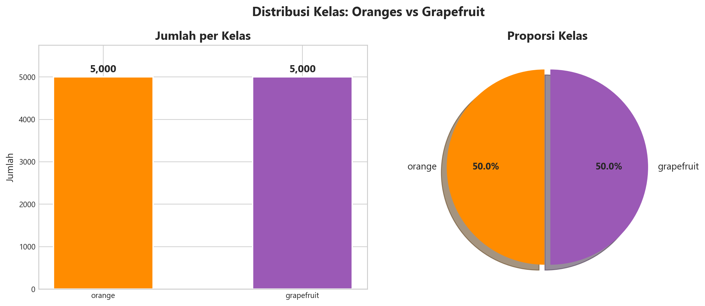
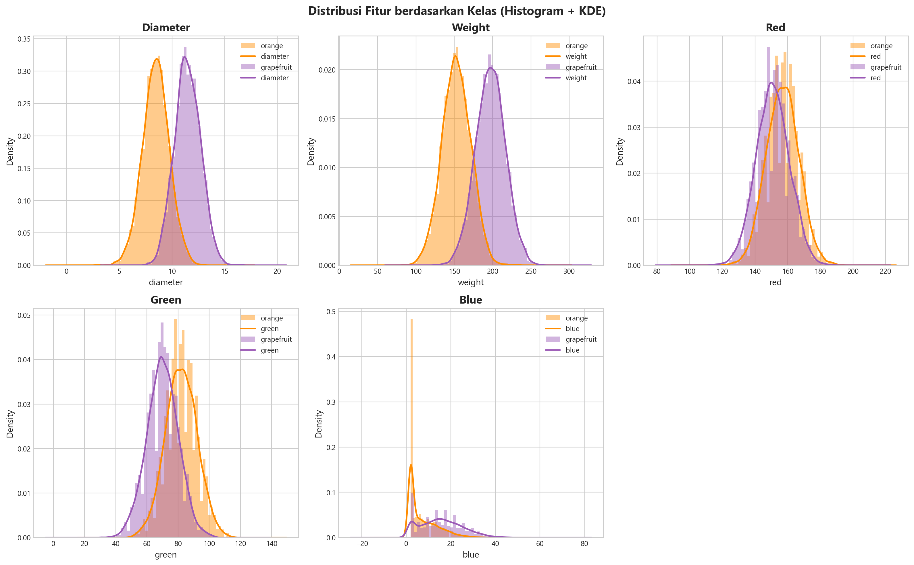
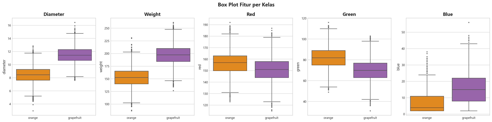
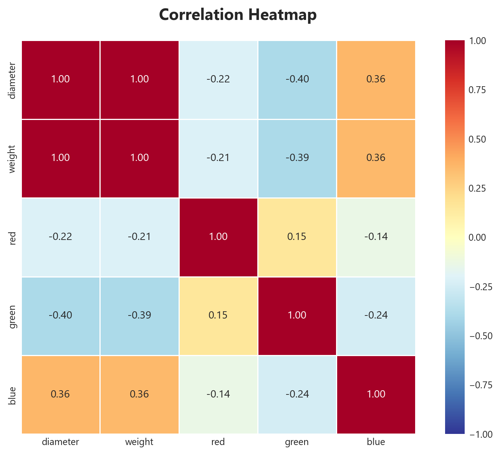
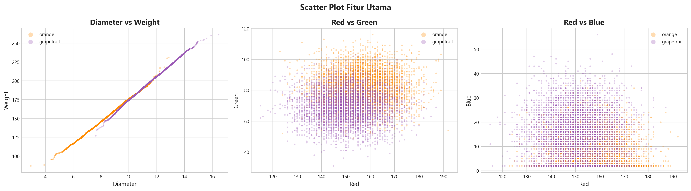
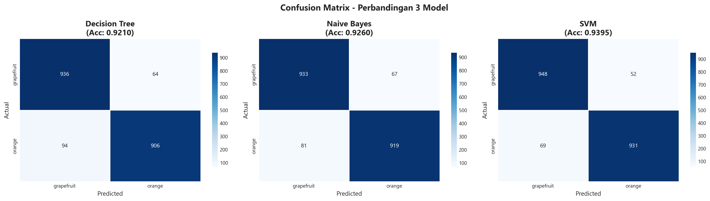
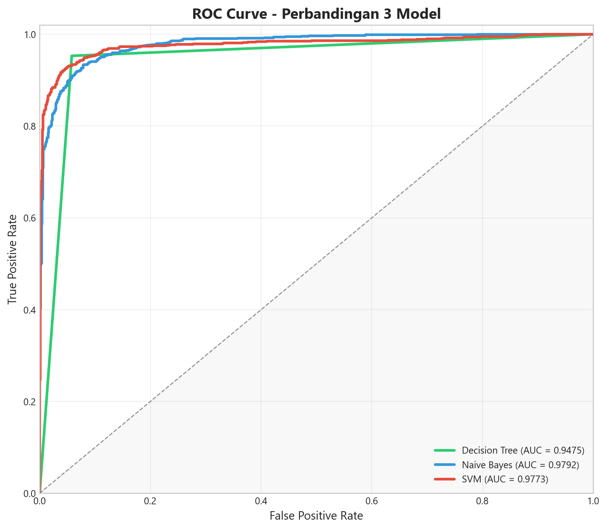
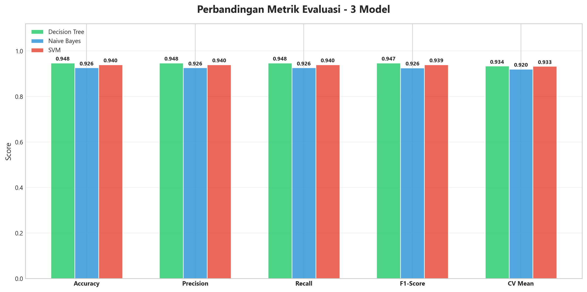
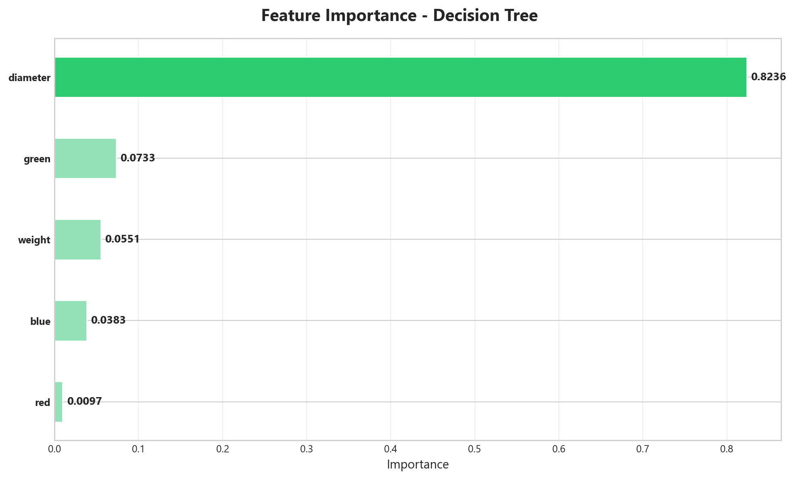
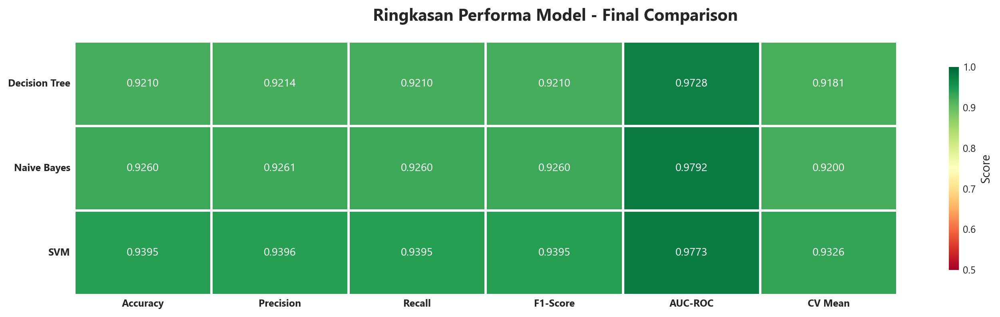

# Oranges vs Grapefruit — Klasifikasi dengan Decision Tree, Naive Bayes, dan SVM

<div align="center">


</div>

> **Ujian Tengah Semester — Machine Learning**
>
> Proyek ini menjawab soal UTS untuk membangun dan membandingkan tiga model klasifikasi
> (Decision Tree, Naive Bayes, dan SVM) dalam mengidentifikasi apakah suatu buah
> merupakan **jeruk (orange)** atau **grapefruit** berdasarkan karakteristik fisiknya.

---

## Daftar Isi

- [Project Overview](#project-overview)
- [Methodology](#methodology)
- [Dataset Architecture](#dataset-architecture)
- [Data Pipeline](#data-pipeline)
- [Model Implementation](#model-implementation)
- [Performance Evaluation](#performance-evaluation)
- [Comparative Analysis](#comparative-analysis)
- [Installation & Usage](#installation--usage)
- [Project Structure](#project-structure)
- [System Architecture](#system-architecture)
- [Author](#author)

---

## Project Overview

Proyek ini merupakan sistem klasifikasi berbasis Machine Learning untuk membedakan kategori buah antara **Orange** dan **Grapefruit**. Menggunakan dataset karakteristik fisik (diameter, berat) dan fitur warna (RGB), sistem ini membandingkan tiga arsitektur model berbeda untuk menentukan akurasi prediksi tertinggi dalam skenario industri klasifikasi pangan otomatis.

### Core Algorithms

| Algoritma | Kategori | Keunggulan |
|-----------|----------|------------|
| **Decision Tree** | Tree-based | Interpretabilitas tinggi & mampu menangkap aturan keputusan non-linear. |
| **Naive Bayes** | Probabilistic | Komputasi ringan & sangat cepat untuk klasifikasi probabilistik. |
| **SVM (RBF Kernel)** | Kernel-based | Robust terhadap dimensionalitas tinggi & optimal dalam pemisahan margin. |

## Methodology

Implementasi proyek ini mengikuti *standard data science pipeline* yang mencakup:
*   **Automated Data Loading**: Sistem pemuatan data modular dengan validasi integritas schema.
*   **Exploratory Data Analysis (EDA)**: Visualisasi statistik terpadu untuk identifikasi pola fitur.
*   **Advanced Preprocessing**: Transformasi data terstandarisasi, termasuk label encoding dan feature scaling (StandardScaler).
*   **Multi-Model Training**: Pelatihan paralel tiga algoritma berbeda dengan parameter yang dioptimasi.
*   **Comprehensive Evaluation**: Pengukuran performa menggunakan metrik industri (Accuracy, F1-Score, AUC-ROC) dan visualisasi Confusion Matrix.

---

## Dataset Architecture

- **Sumber** : [Kaggle — Oranges vs. Grapefruit](https://www.kaggle.com/datasets/joshmcadams/oranges-vs-grapefruit)
- **Jumlah Data** : 10.000 sampel
- **Lisensi** : CC0 (Public Domain)

### 2.1 Deskripsi Fitur

| Fitur | Tipe Data | Deskripsi | Satuan |
|-------|-----------|-----------|--------|
| `name` | Categorical | Label target — `orange` atau `grapefruit` | — |
| `diameter` | Continuous | Diameter buah | Inci |
| `weight` | Continuous | Berat buah | Gram |
| `red` | Discrete | Komponen warna merah (channel R) | 0–255 |
| `green` | Discrete | Komponen warna hijau (channel G) | 0–255 |
| `blue` | Discrete | Komponen warna biru (channel B) | 0–255 |

### 2.2 Statistik Deskriptif

| Statistik | diameter | weight | red | green | blue |
|-----------|----------|--------|-----|-------|------|
| **Mean** | 9.98 | 175.05 | 153.85 | 76.01 | 11.36 |
| **Std** | 1.95 | 29.21 | 10.43 | 11.71 | 9.06 |
| **Min** | 2.96 | 86.76 | 115.00 | 31.00 | 2.00 |
| **Median** | 9.98 | 174.98 | 154.00 | 76.00 | 10.00 |
| **Max** | 16.45 | 261.51 | 192.00 | 116.00 | 56.00 |

**Temuan awal:**
- Tidak ada missing values pada seluruh kolom
- Distribusi kelas **seimbang** — 5.000 orange dan 5.000 grapefruit (rasio 1:1)
- Karena dataset balanced, metrik accuracy dapat digunakan secara andal tanpa bias kelas mayoritas

---

## Data Pipeline

### Tahap 1 — Data Loading & Exploration

> **File:** `src/data_loader.py`

Pada tahap ini dilakukan pemuatan dataset dan eksplorasi awal untuk memahami struktur serta kualitas data.

**Langkah-langkah yang dilakukan:**

| No | Langkah | Hasil |
|----|---------|-------|
| 1 | Memuat dataset dari `data/citrus.csv` | 10.000 baris × 6 kolom berhasil dimuat |
| 2 | Memeriksa tipe data setiap kolom | 1 kolom kategorikal (target), 5 kolom numerik (fitur) |
| 3 | Cek missing values | **0 missing values** — data bersih, tidak perlu imputasi |
| 4 | Statistik deskriptif (mean, std, min, max, quartile) | Rentang fitur bervariasi (perlu scaling untuk SVM) |
| 5 | Distribusi kelas target | Seimbang 50:50 — tidak perlu teknik oversampling/undersampling |

**Kesimpulan tahap ini:**
Data dalam kondisi baik dan siap untuk tahap selanjutnya. Tidak diperlukan pembersihan data (data cleaning) karena tidak terdapat anomali pada struktur maupun isi data.

---

### Tahap 2 — Exploratory Data Analysis (EDA)

> **File:** `src/eda.py`

EDA bertujuan untuk memahami pola, distribusi, dan hubungan antar fitur sebelum membangun model. Berikut adalah lima visualisasi yang dihasilkan beserta analisisnya:

### 4.1 Distribusi Kelas

<p align="center">
  
</p>

**Analisis:** Dataset memiliki distribusi kelas yang sempurna seimbang (50:50). Hal ini penting karena:
- Model tidak akan bias ke salah satu kelas
- Metrik accuracy dapat diandalkan sebagai indikator performa
- Tidak diperlukan teknik resampling (SMOTE, undersampling, dll.)

### 4.2 Distribusi Fitur (Histogram + KDE)

<p align="center">
  
</p>

**Analisis:**
- **Diameter & Weight:** Terdapat overlap antara orange dan grapefruit, namun grapefruit cenderung memiliki diameter dan berat yang lebih besar. Ini merupakan fitur diskriminatif yang kuat.
- **Red:** Distribusi kedua kelas sangat mirip dan saling tumpang tindih, artinya fitur ini kurang informatif untuk klasifikasi.
- **Green & Blue:** Terdapat sedikit perbedaan distribusi yang dapat membantu pembeda.

### 4.3 Box Plot per Fitur

<p align="center">
  
</p>

**Analisis:**
- Fitur `diameter` dan `weight` menunjukkan perbedaan median yang jelas antara kedua kelas — ini mengonfirmasi bahwa grapefruit secara fisik lebih besar dari orange
- Fitur warna (`red`, `green`, `blue`) memiliki median yang relatif dekat antar kelas, tetapi tetap berkontribusi pada klasifikasi
- Terdapat beberapa outlier pada setiap fitur, namun jumlahnya kecil dan tidak memerlukan penanganan khusus

### 4.4 Correlation Heatmap

<p align="center">
  
</p>

**Analisis:**
- `diameter` dan `weight` memiliki korelasi yang **sangat tinggi** (~0.99) — hal ini logis karena buah yang lebih besar pasti lebih berat
- Meskipun berkorelasi tinggi, keduanya tetap dipertahankan karena algoritma seperti Decision Tree dan SVM dapat menangani multikolinearitas dengan baik
- Fitur warna (RGB) memiliki korelasi rendah terhadap fitur fisik, artinya memberikan informasi tambahan yang berbeda

### 4.5 Scatter Plot Fitur Utama

<p align="center">
  
</p>

**Analisis:**
- **Diameter vs Weight:** Kedua kelas membentuk kluster yang cukup terpisah dengan area overlap di tengah — ini menunjukkan masalah klasifikasi yang **cukup menantang** namun dapat diselesaikan
- **Red vs Green:** Overlap lebih besar, menunjukkan fitur warna saja tidak cukup untuk klasifikasi sempurna
- **Red vs Blue:** Pola serupa, mempertegas bahwa kombinasi fitur fisik + warna diperlukan

---

### Tahap 3 — Data Preprocessing

> **File:** `src/preprocessing.py`

Tahap preprocessing mempersiapkan data agar siap digunakan untuk pelatihan model.

### 5.1 Label Encoding

Target variabel `name` diubah menjadi bentuk numerik menggunakan `LabelEncoder`:

| Label Asli | Encoded |
|------------|---------|
| `grapefruit` | 0 |
| `orange` | 1 |

### 5.2 Train-Test Split

Data dibagi menjadi **training set** dan **testing set** dengan konfigurasi:

| Parameter | Nilai | Alasan |
|-----------|-------|--------|
| Rasio split | 80:20 | Standard ratio yang menyeimbangkan kebutuhan training dan evaluasi |
| Stratified | Ya | Memastikan proporsi kelas tetap seimbang pada kedua set |
| Random state | 42 | Untuk reproducibility — hasil eksperimen dapat diulang kembali |

**Hasil split:**
- Training set: **8.000 sampel**
- Testing set: **2.000 sampel**

### 5.3 Feature Scaling (StandardScaler)

Normalisasi fitur menggunakan StandardScaler (z-score normalization):

$$x_{scaled} = \frac{x - \mu}{\sigma}$$

| Aspek | Penjelasan |
|-------|-----------|
| **Mengapa diperlukan?** | SVM dengan kernel RBF sensitif terhadap skala fitur. Tanpa scaling, fitur dengan rentang besar (weight: 86–261) akan mendominasi fitur dengan rentang kecil (blue: 2–56) |
| **Metode** | StandardScaler (z-score) — mengubah setiap fitur agar memiliki mean=0 dan std=1 |
| **Fit pada?** | Hanya pada training set (`fit_transform`), lalu diterapkan ke test set (`transform`) untuk menghindari data leakage |
| **Model yang terdampak** | SVM menggunakan data scaled; Decision Tree dan Naive Bayes menggunakan data original karena keduanya tidak sensitif terhadap skala |

---

## Model Implementation

### Tahap 4 — Model Training

> **File:** `src/models.py`

### 6.1 Decision Tree Classifier

```python
DecisionTreeClassifier(random_state=42)
```

Model menggunakan **parameter default** dari scikit-learn agar perbandingan antar ketiga model bersifat **fair** — tidak ada pembatasan kedalaman pohon sehingga Decision Tree dapat menunjukkan performa optimalnya.

| Parameter | Nilai | Penjelasan |
|-----------|-------|------------|
| `criterion` | gini (default) | Menggunakan Gini impurity untuk menentukan split terbaik |
| `max_depth` | None (default) | Pohon tumbuh hingga semua leaf murni atau tidak bisa di-split lagi |
| `random_state` | 42 | Untuk reproducibility |

**Cara kerja:** Decision Tree membangun aturan keputusan bercabang dengan memilih fitur dan threshold yang paling optimal (berdasarkan Gini impurity) pada setiap node. Data dipartisi secara rekursif hingga mencapai kondisi terminal.

**Kelebihan:** Mudah diinterpretasi, tidak perlu feature scaling, dapat menangkap hubungan non-linear.
**Kekurangan:** Rentan overfitting jika kedalaman tidak dibatasi, namun pada dataset ini dengan 10.000 sampel, risikonya relatif kecil.

### 6.2 Gaussian Naive Bayes

```python
GaussianNB()
```

**Cara kerja:** Menghitung probabilitas posterior setiap kelas menggunakan Teorema Bayes:

$$P(C|X) = \frac{P(X|C) \cdot P(C)}{P(X)}$$

Dengan asumsi bahwa setiap fitur bersifat independen satu sama lain (naive assumption) dan mengikuti distribusi Gaussian (normal).

**Kelebihan:** Sangat cepat, bekerja baik meski dengan dataset kecil, robust terhadap fitur yang tidak relevan.
**Kekurangan:** Asumsi independensi fitur sering kali tidak terpenuhi di dunia nyata (contoh: `diameter` dan `weight` sangat berkorelasi).

### 6.3 Support Vector Machine (SVM)

```python
SVC(
    kernel='rbf',
    C=1.0,
    gamma='scale',
    probability=True,
    random_state=42
)
```

| Parameter | Nilai | Penjelasan |
|-----------|-------|------------|
| `kernel` | RBF (Radial Basis Function) | Memungkinkan decision boundary non-linear |
| `C` | 1.0 | Trade-off antara margin lebar (generalisasi) vs. klasifikasi akurat pada training set |
| `gamma` | scale | Otomatis dihitung sebagai `1 / (n_features * X.var())` |
| `probability` | True | Mengaktifkan estimasi probabilitas (diperlukan untuk ROC curve) |

**Cara kerja:** SVM mencari hyperplane optimal yang memaksimalkan margin antara dua kelas. Dengan kernel RBF, data di-mapping ke dimensi yang lebih tinggi sehingga boundary non-linear pada ruang asli menjadi linear di ruang baru.

**Kelebihan:** Sangat efektif pada data berdimensi tinggi, robust terhadap overfitting (melalui margin maximization).
**Kekurangan:** Memerlukan feature scaling, waktu training lebih lama pada dataset besar.

---

## Performance Evaluation

### Tahap 5 — Evaluasi Model

> **File:** `src/evaluation.py`

### 7.1 Metrik Evaluasi yang Digunakan

| Metrik | Formula | Interpretasi |
|--------|---------|--------------|
| **Accuracy** | (TP + TN) / Total | Proporsi prediksi yang benar dari keseluruhan data |
| **Precision** | TP / (TP + FP) | Dari semua yang diprediksi positif, berapa yang benar-benar positif |
| **Recall** | TP / (TP + FN) | Dari semua data positif, berapa yang berhasil terdeteksi |
| **F1-Score** | 2 × (Precision × Recall) / (Precision + Recall) | Rata-rata harmonik antara precision dan recall |
| **AUC-ROC** | Area Under ROC Curve | Kemampuan model dalam membedakan dua kelas (0.5 = random, 1.0 = sempurna) |
| **Cross-Validation** | Rata-rata accuracy dari 5-fold CV | Mengukur konsistensi dan generalisasi model |

### 7.2 Hasil Evaluasi

#### Tabel Perbandingan Performa

| Model | Accuracy | Precision | Recall | F1-Score | AUC-ROC | CV Mean ± Std |
|-------|----------|-----------|--------|----------|---------|---------------|
| **Decision Tree** | **0.9475** | **0.9476** | **0.9475** | **0.9475** | 0.9475 | **0.9338** ± 0.0048 |
| **Naive Bayes** | 0.9260 | 0.9261 | 0.9260 | 0.9260 | **0.9792** | 0.9200 ± 0.0054 |
| **SVM** | 0.9395 | 0.9396 | 0.9395 | 0.9395 | 0.9773 | 0.9326 ± 0.0028 |

#### Classification Report Detail

**Decision Tree:**
| Kelas | Precision | Recall | F1-Score | Support |
|-------|-----------|--------|----------|---------|
| grapefruit | 0.95 | 0.94 | 0.95 | 1000 |
| orange | 0.94 | 0.95 | 0.95 | 1000 |

**Naive Bayes:**
| Kelas | Precision | Recall | F1-Score | Support |
|-------|-----------|--------|----------|---------|
| grapefruit | 0.92 | 0.93 | 0.93 | 1000 |
| orange | 0.93 | 0.92 | 0.93 | 1000 |

**SVM:**
| Kelas | Precision | Recall | F1-Score | Support |
|-------|-----------|--------|----------|---------|
| grapefruit | 0.93 | 0.95 | 0.94 | 1000 |
| orange | 0.95 | 0.93 | 0.94 | 1000 |

### 7.3 Visualisasi Evaluasi

#### Confusion Matrix

<p align="center">
  
</p>

**Analisis per model:**
- **Decision Tree:** 943 grapefruit benar, 952 orange benar. Jumlah kesalahan paling sedikit (105 total). Model terbaik.
- **Naive Bayes:** 933 grapefruit benar, 919 orange benar. Performa lebih merata antar kelas.
- **SVM:** 948 grapefruit benar, 931 orange benar. Performa sangat baik (121 kesalahan total).

#### ROC Curve

<p align="center">
  
</p>

**Analisis:** Ketiga model menunjukkan AUC-ROC di atas 0.97, artinya kemampuan diskriminasi sangat baik. Naive Bayes memiliki AUC tertinggi (0.9792), menunjukkan probabilitas kelas yang dihasilkan sangat terkalibrasi dengan baik, meskipun accuracy-nya bukan yang terbaik.

#### Perbandingan Metrik

<p align="center">
  
</p>

**Analisis:** Decision Tree secara konsisten unggul pada semua metrik utama (accuracy, precision, recall, F1-score, CV mean), menunjukkan bahwa algoritma tree-based sangat cocok untuk dataset ini karena mampu menangkap aturan keputusan yang jelas antara kedua kelas.

#### Feature Importance (Decision Tree)

<p align="center">
  
</p>

**Analisis:** Decision Tree mengungkapkan bahwa fitur yang paling berpengaruh adalah **diameter** dan **weight** — ini sejalan dengan temuan EDA bahwa grapefruit secara fisik lebih besar. Fitur warna (RGB) berkontribusi lebih kecil tetapi tetap membantu meningkatkan akurasi.

#### Ringkasan Akhir (Heatmap)

<p align="center">
  
</p>

---

## Comparative Analysis

### Tahap 6 — Perbandingan & Kesimpulan

### 8.1 Analisis Perbandingan

#### Decision Tree (Model Terbaik)
- **Performa:** Accuracy **94.75%**, F1-Score **0.9475**
- **Kelebihan pada dataset ini:** Performa tertinggi di antara ketiga model. Memberikan interpretabilitas tinggi melalui feature importance sehingga kita dapat mengetahui bahwa `diameter` dan `weight` adalah faktor pembeda utama. Mampu menangkap aturan keputusan non-linear secara alami tanpa perlu feature scaling.
- **CV Mean:** 0.9338 — menunjukkan generalisasi yang baik
- **CV Std:** 0.0048 — stabilitas baik

#### Naive Bayes
- **Performa:** Accuracy 92.60%, F1-Score 0.9260
- **Kelebihan pada dataset ini:** Waktu training paling cepat. AUC-ROC tertinggi (0.9792), menunjukkan estimasi probabilitas yang sangat terkalibrasi. Cocok sebagai baseline yang kuat.
- **Kelemahan:** Asumsi independensi fitur dilanggar (diameter berkorelasi 0.99 dengan weight), sehingga performa tidak seoptimal model lain.
- **CV Std:** 0.0054 — sedikit lebih bervariasi dibanding model lain

#### SVM
- **Performa:** Accuracy 93.95%, F1-Score 0.9395
- **Kelebihan pada dataset ini:** Performa sangat baik, hanya sedikit di bawah Decision Tree. Kernel RBF berhasil menangkap boundary non-linear antara kedua kelas.
- **Kelemahan:** Memerlukan feature scaling (StandardScaler) dan waktu training lebih lama dibanding kedua model lainnya.
- **CV Std:** 0.0028 — stabilitas terbaik (variasi antar fold paling rendah)

### 8.2 Kesimpulan

> **Model terbaik: Decision Tree** dengan accuracy **94.75%** dan F1-Score **0.9475**.

**Alasan pemilihan:**

1. **F1-Score tertinggi (0.9475)** — Dipilih sebagai metrik utama karena menyeimbangkan precision dan recall. Decision Tree mengungguli SVM (0.9395) dan Naive Bayes (0.9260) pada metrik ini.

2. **Accuracy tertinggi (94.75%)** — Dari 2.000 data uji, Decision Tree hanya salah mengklasifikasi 105 sampel, lebih sedikit dibanding SVM (121 kesalahan) dan Naive Bayes (148 kesalahan).

3. **Interpretabilitas tinggi** — Berbeda dengan SVM yang bersifat "black box", Decision Tree memberikan visualisasi aturan keputusan yang jelas dan fitur importance yang mudah dipahami. Dalam konteks industri pertanian, kemampuan untuk menjelaskan *mengapa* suatu buah diklasifikasikan tertentu sangat penting.

4. **Tidak memerlukan preprocessing khusus** — Decision Tree bekerja langsung pada data original tanpa perlu feature scaling, menjadikannya lebih sederhana untuk deployment.

**Insight tambahan:**
- Ketiga model memiliki performa tinggi (>92%), menunjukkan bahwa dataset ini memiliki pola yang cukup jelas untuk dipisahkan
- Fitur `diameter` dan `weight` merupakan pembeda utama antara orange dan grapefruit
- Fitur warna (RGB) memberikan kontribusi tambahan meskipun tidak se-informatif fitur fisik
- Naive Bayes memiliki AUC-ROC tertinggi (0.9792), menunjukkan bahwa estimasi probabilitasnya paling terkalibrasi meskipun accuracy-nya terendah

---

## Installation & Usage

### Prerequisites

- Python 3.8 atau lebih baru
- pip (Python package manager)

### Langkah-langkah

```bash
# 1. Clone repository
git clone https://github.com/<username>/oranges-vs-grapefruit-clasification.git
cd oranges-vs-grapefruit-clasification

# 2. (Opsional) Buat virtual environment
python -m venv venv
venv\Scripts\activate          # Windows
# source venv/bin/activate     # Linux/Mac

# 3. Install dependencies
pip install -r requirements.txt

# 4. Jalankan program
python main.py
```

### Output

Program akan menghasilkan:
- **Terminal:** Tahapan proses lengkap + tabel perbandingan performa model
- **Folder `output/`:** 10 visualisasi dalam format PNG

---

## Project Structure

```
oranges-vs-grapefruit-clasification/
│
├── data/
│   └── citrus.csv                  # Dataset (10.000 sampel)
│
├── src/                            # Source code (modular)
│   ├── __init__.py                 # Package initializer
│   ├── config.py                   # Konfigurasi, warna, konstanta
│   ├── data_loader.py              # Tahap 1: Load & explore data
│   ├── eda.py                      # Tahap 2: EDA & visualisasi
│   ├── preprocessing.py            # Tahap 3: Preprocessing pipeline
│   ├── models.py                   # Tahap 4: Training 3 model
│   └── evaluation.py               # Tahap 5-6: Evaluasi & kesimpulan
│
├── output/                         # Hasil visualisasi (auto-generated)
│   ├── 01_class_distribution.png
│   ├── 02_feature_distributions.png
│   ├── 03_boxplots.png
│   ├── 04_correlation_heatmap.png
│   ├── 05_scatter_plots.png
│   ├── 06_confusion_matrices.png
│   ├── 07_roc_curves.png
│   ├── 08_metrics_comparison.png
│   ├── 09_feature_importance.png
│   └── 10_final_summary.png
│
├── main.py                         # Entry point (orchestrator)
├── requirements.txt                # Python dependencies
├── .gitignore                      # Git ignore rules
└── README.md                       # Dokumentasi (file ini)
```

**Desain modular:** Kode dipisahkan berdasarkan tanggung jawab (separation of concerns). Setiap modul bertanggung jawab atas satu tahapan, sehingga mudah dibaca, di-maintain, dan di-extend.

---

## System Architecture

| Library | Versi | Fungsi |
|---------|-------|--------|
| `pandas` | ≥ 2.0 | Manipulasi dan analisis data tabular |
| `numpy` | ≥ 1.24 | Komputasi numerik dan operasi array |
| `scikit-learn` | ≥ 1.3 | Machine learning (model, preprocessing, evaluasi) |
| `matplotlib` | ≥ 3.7 | Framework visualisasi data (low-level) |
| `seaborn` | ≥ 0.12 | Visualisasi statistik (high-level, berbasis matplotlib) |

---

## 12. Author

| | |
|---|---|
| **Nama** | Nazwa Yulianti M |
| **NIM** | 1237050007 |
| **Mata Kuliah** | Machine Learning |
| **Tugas** | Ujian Tengah Semester (UTS) |
